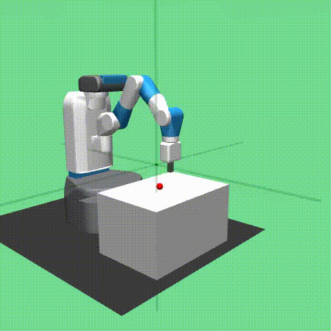
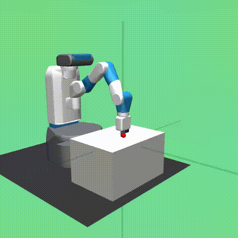

# Hindsight Goal Ranking

PyTorch implementation of [Hindsight Goal Ranking on Replay Buffer for Sparse Reward Environment](https://ieeexplore.ieee.org/stamp/stamp.jsp?tp=&arnumber=9391700)

- Basic idea : enhance sample efficiency through advanced sampling techniques that allow to do multi-goal reinforcement learning in continuous domains (aka Robotics)
- Algorithmic backbone : DDPG

## Results: Reach

 

## Results: Pick-and-place

  

## Results: Push

  

 
